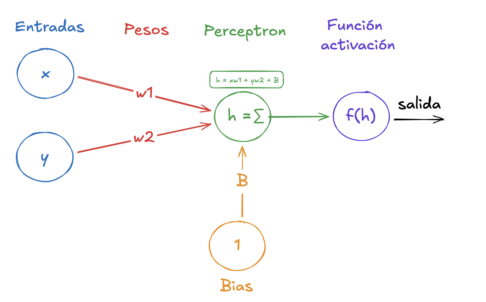
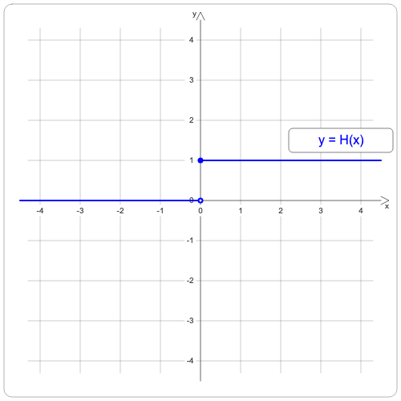

# Comando basicos

```
python3 archivo -> correr

cmd + Shift + v -> pre-visualizador del readme 
cmd + k + sueltas + presionas: v -> lado a lado visualizar el readme 

```

# Problema a desarrollar: Clasificacion de puntos en 2D y 3D

Este repositorio tiene como objetivo explicar y demostrar de forma pedagogica como funciona el perceptron y que se debe tener en mente a la hora de emplear uno. Este proyecto tiene como objetivo clasificar datos en dos clases, especificamente, se trabaja con nubes de puntos en dos dimensiones, que posteriormente se extediente a tres dimensiones; se busca explicar por qué el perceptron es la herramienta indicada para este problema, siempre y cuando las grupos de puntos sean linealmente separables.

## Objetivos

    •	Implementar un perceptrón binario sin librerías de machine learning.
    •	Clasificar dos nubes de puntos en 2D mediante una recta.
    •	Extender el modelo a 3 entradas (3D), donde la frontera de decisión es un plano.
    •	Analizar el comportamiento y limitaciones del modelo.
    •   Mostrar visualmente los resultados mediante Unity

<!-- # Fundamentos Teoricos -->

# ¿Que es un perceptron?

El perceptron es la unidad fundamental y mas simple dentro de la inteligencia artificial, funciona como una unica "neurona" y se caracteriza por ser un clasificador binario. Es decir, solo puede diferenciar entre dos cosas. Funciona bajo el aprendizaje de maquina supervisado, requiere de datos base para entrenarse en el contexto en la que requeramos usarla.

Es uno de los modelos más simples dentro del aprendizaje automático y constituye la base de las redes neuronales.

**Partes de un perceptron**
Entradas : son los datos que recibe el modelo, No son “solo números”: epresentan características del problema. En nuestro tenemos dos entradas x y que serian las coordenadas de cada punto
Pesos : Cada entrada tiene un peso, Son los parámetros que el modelo ajusta. Son un vector normal a la frontera de decisión y nos definen la orientación de la recta o plano
Sesgo / Bias: El sesgo permite desplazar la frontera, y esto por qué? nos ayuda a mover la recta del punto de origen y asi ajustarse a la solucion de mejor manera.
Salida: Cada perceptron tiene una salida, este es el resultado despues de evaluar sus entradas

## ¿En que consiste el trabajo del perceptron?

Desde la explicación matematica, El perceptrón calcula una combinación lineal de las entradas:
• $x_i$: entradas
• $w_i$: pesos
• $b$: sesgo (bias)
• $f$: función de activación


## ¿Como el hará para saber que punto pertenece a que grupo?

Esto es posible gracias a la **Intercepcion Geometrica**, El perceptrón define una frontera de decisión dada por:
$w_1  x_1 + w_2 x_2 + b = 0$ y eso lo evalua una funcion

    •	En 2D: una recta
    •	En 3D: un plano
    •	En dimensiones superiores: un hiperplano

El vector de pesos define la orientación de la frontera.

Los puntos que caen a un lado de esta frontera se clasifican como una clase, y los del otro lado como la clase opuesta. Es decir que, una nube de puntos debe de tener como resultado de la expresión matematica _0_ y la otra debe de tener cualquier otro resultado, en este caso diremos que es _1_ ----> _Por ello la clasificación binaria_



## Funcion de activacion

La función de activación es una función matemática que toma la suma ponderada de las entradas y aplica una transformación para producir la salida del perceptrón. El umbral puede considerarse como un valor específico de la función de activación que determina cuándo el perceptrón debe "activarse" o producir una salida

Hay muchas funciones que se pueden aplicar a un perceptron. Pero como estamos en un problema lineal usaremos la tradicional: **_Función escalón_**

---
que en terminos sencillos podemos expresarla de la siguiente manera:

$$
y = F(h) \begin{cases}
1 & \text{si } z \geq 0 \\
0 & \text{si } z < 0
\end{cases}
$$

Lo que esto nos quiere decir es que: la función evaluará el resultado de la sumatoria que nos da el perceptron, si ese resultado es igual o mayor que cero, el resultado es 1; pero si es menor que 0 el resultado es cero. Este resultado es _La salida obtenida_ 

## Porcentraje de error

El perceptron debe de ser lo mas preciso posible asi que por ello siempre debemos de tener una tolerancia al error lo más baja posible $Error = 0.1$. El porcentaje de error es la diferencia entre: **El valor que esperabamos - el valor que obtuvimos**. Si el error es mayor al que toleramos, toca entrenar a el perceptron en ese caso en especifico.

## Aprendizaje del perceptrón

$$dw = \beta \cdot (y_{valor deseado} - Y_{valor obtenido}) \cdot x$$

donde:

1. $\beta $: Es la tasa de aprendizaje  -> el ritmo con el que el perceptron aprende, entre más grande el aprendizaje es mas rapdio pero menos preciso en casos muy exigidos.
2. $y_{valor deseado}$: El resultado que se esperaba o verdadero
3. $Y_{valor obtenido}$: El resultado que nos esta dando el perceptron de momento
4. $x$: valor actual de la entrada

**Entranamiento del Bias:** el sesgo es un peso más, pero su entrada siempre es 1, por lo que su aprendizaje seria
$$db = \beta  \cdot (y_{valor deseado} - Y_{valor obtenido}) $$

El bias es a veces necesario porque las entradas sumadas no llegan no llegan al valor del umbral. el sesgo desplaza la funcion. **_EL sesgo podria activar la neurona incluso sin entradas_**

## Epocas

Una epoca la definimos como una iteración sobre todo el conjutnos de entrenamiento -> "una pasada completa"
